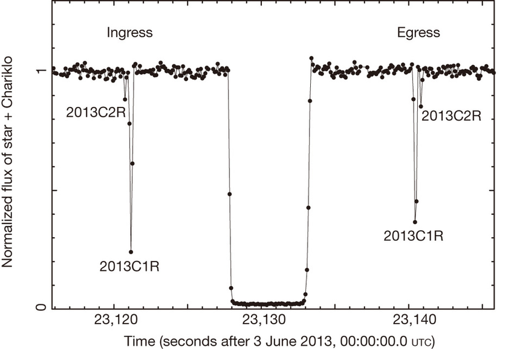

.. _Sec:stellar_occultation_overview:

A Stellar Occultation Overview
==============================

A stellar occultation is an event that occurs when, from the perspective
of an observer on Earth, a solar system object passes in front of a star.
Since we can measure the light flux of a star when the passing object 
blocks that flux, we can analyze the temporary drop of light. With the 
resulting graph, it's possible to determine multiple characteristics of 
the occulting body, such as size, shape, albedo, presence of an atmosphere,
rings, jets, and other structures  (Sicardy et al. `2011 <https://ui.adsabs.harvard.edu/abs/2011Natur.478..493S/abstract>`_, `2016 <https://ui.adsabs.harvard.edu/abs/2016ApJ...819L..38S/abstract>`_, 
Braga-Ribas et al. `2013 <https://ui.adsabs.harvard.edu/abs/2013ApJ...773...26B/abstract>`_, `2014 <https://ui.adsabs.harvard.edu/abs/2014Natur.508...72B/abstract>`_, `2019 <https://ui.adsabs.harvard.edu/abs/2019JPhCS1365a2024B/abstract>`_, Dias-Oliveira et al., `2015 <https://ui.adsabs.harvard.edu/abs/2015ApJ...811...53D/abstract>`_,
Benedetti-Rossi et al., `2016 <https://ui.adsabs.harvard.edu/abs/2016AJ....152..156B/abstract>`_, `2019 <https://ui.adsabs.harvard.edu/abs/2019AJ....158..159B/abstract>`_, Ortiz et al., `2015 <https://ui.adsabs.harvard.edu/abs/2015EPSC...10..230O/abstract>`_, `2017 <https://ui.adsabs.harvard.edu/abs/2017Natur.550..219O/abstract>`_, `2020 <https://ui.adsabs.harvard.edu/abs/2020A%26A...639A.134O/abstract>`_,
Leiva et al., `2017 <https://ui.adsabs.harvard.edu/abs/2017AJ....154..159L/abstract>`_, Bérard et al., `2017 <https://ui.adsabs.harvard.edu/abs/2017AJ....154..144B/abstract>`_, Morgado et al., `2019 <https://ui.adsabs.harvard.edu/abs/2019A%26A...626L...4M/abstract>`_,
Gomes-Júnior et al., `2020 <https://ui.adsabs.harvard.edu/abs/2020MNRAS.492..770G/abstract>`_, Souami et al., `2020 <https://ui.adsabs.harvard.edu/abs/2020A%26A...643A.125S/abstract>`_, Santos-Sanz et al., `2021 <https://ui.adsabs.harvard.edu/abs/2021MNRAS.501.6062S/abstract>`_).
See below the image of the flux of a star when the centaur Chariklo passes
in front of it, where you can see the drop caused by its two rings (2013C2R
and 2013C1R) and by the object itself.

Given the observer and its relative velocity to the body, a chord can be
retrieved from the occultation. A chord is a traced line projected into
the sky plane. Its position and size are mostly derived from two parameters.
The time a body takes to pass through the star, or the size of the valley in
our light curve, measured by the difference between immersion and emersion
times. The other is the velocity of the body.

The occultation curve, the typical valley, can be regressed to some standard
models that are beyond the scope of our documentation but that emerges from
phenomena such as light diffraction. In addition to that, multiple chords can
give a more accurate derivation of the body's format, as we would have more
parameters to fit an ellipse. Given different observers in different locations,
a chord will be projected in a slightly different position and, as said, give
new parameters to our fit.