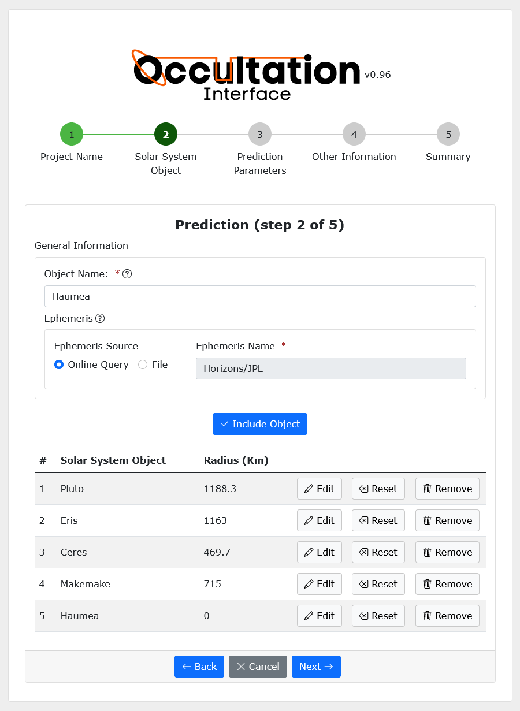
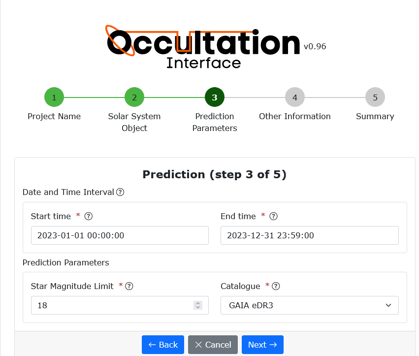
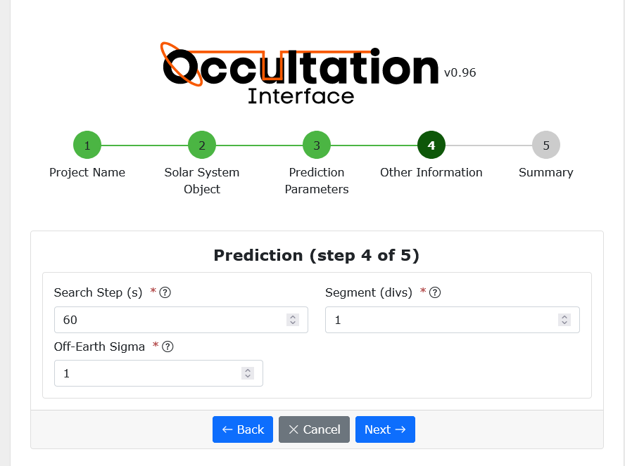
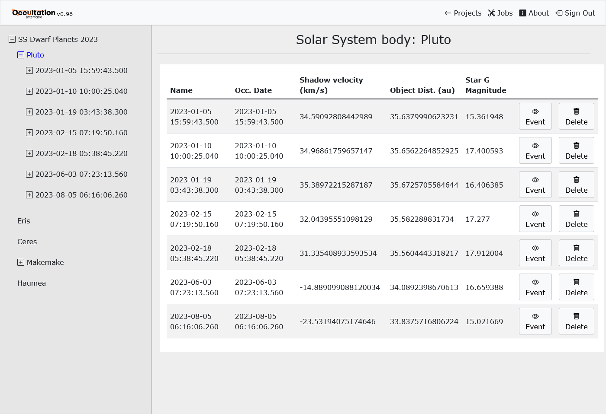
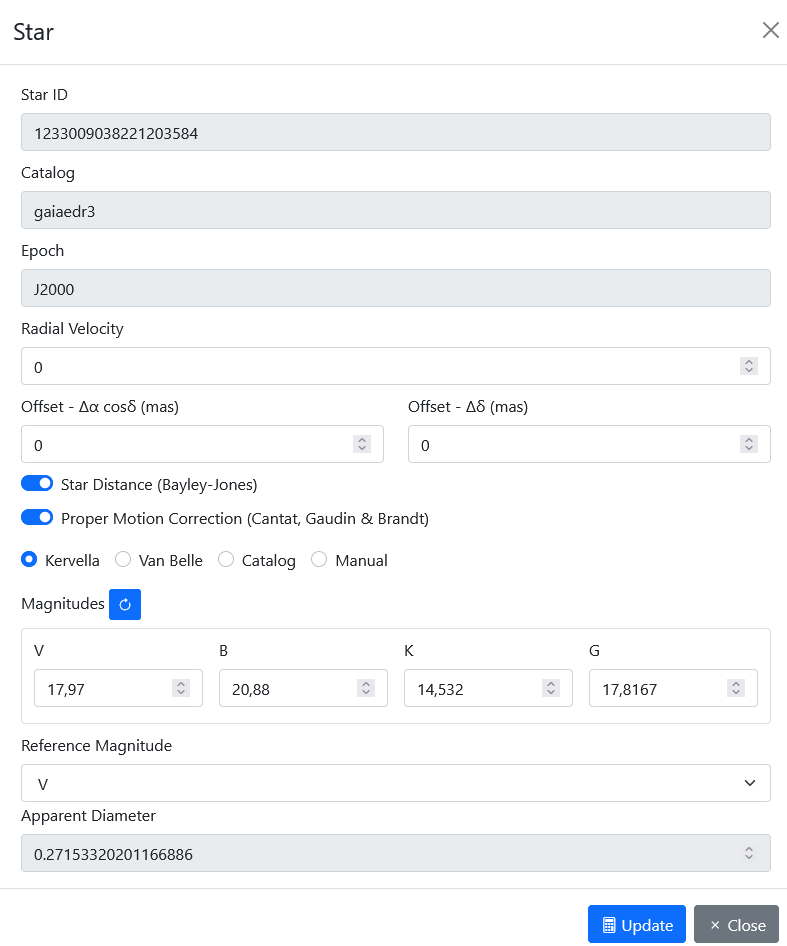
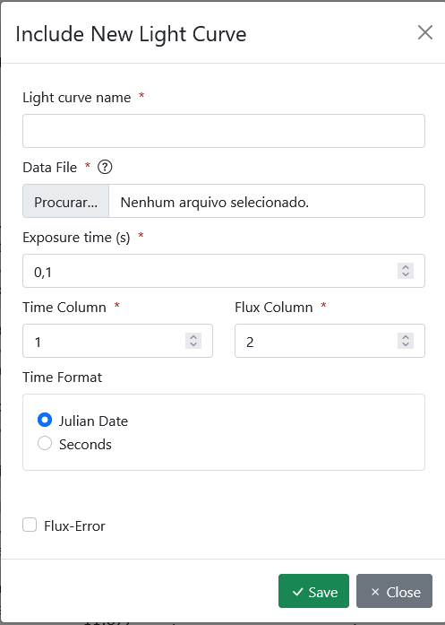
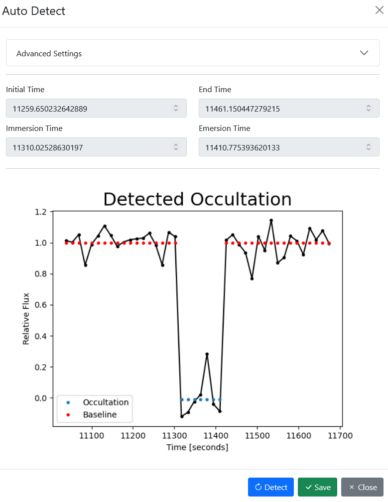
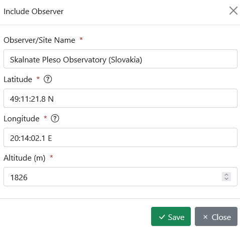
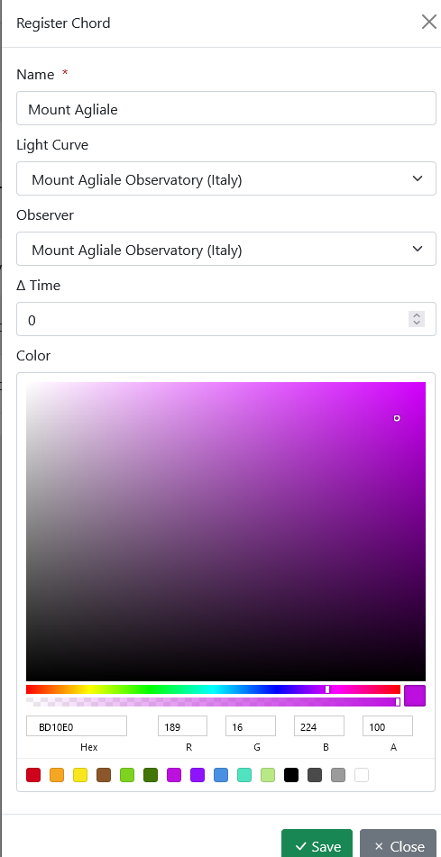
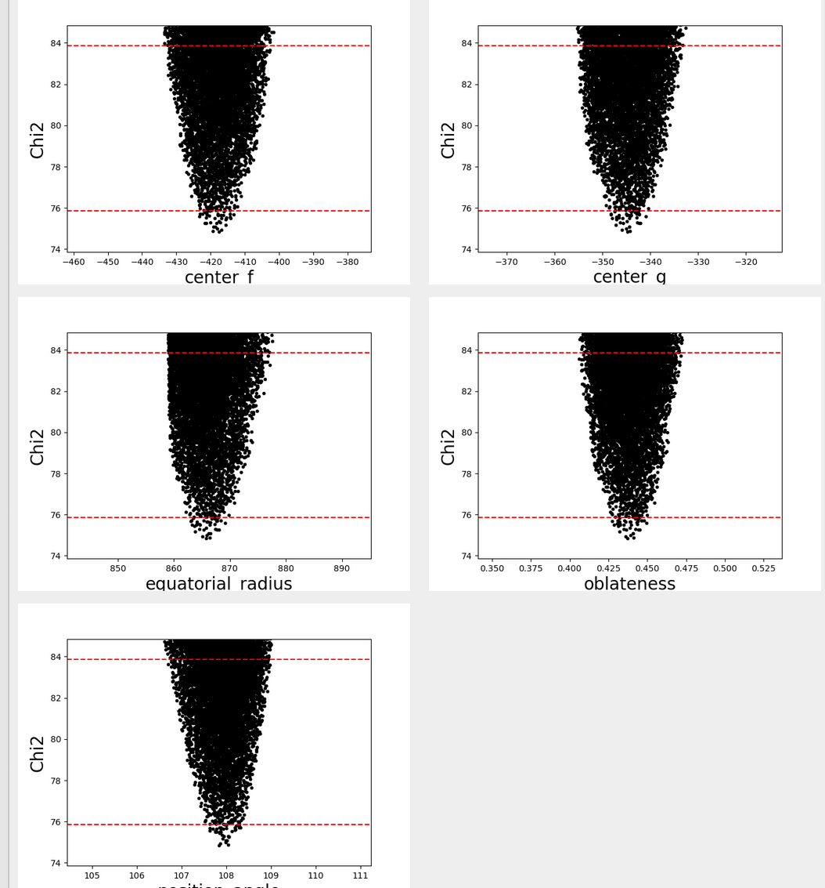

.. _Sec:tutorial:

Quick Start
============

Let’s do a whole project as a way to visualize the processes in the interface. Assuming downloading and executing the interface went ok, we open the ‘Sign Up’ page and created an account. The verification key will arrive briefly in the email account registered so we can log in.

Logged in, we may create our first project.

Initializing a Project
------------------------

After naming the project, we need to add a body. Its identification can be its name, spkid, or designation number to query the SBDB.  For example, if we were to use ‘Paris’ as a body, we could search for ‘Paris’, ‘3317 Paris’, ‘1984 KF’, or ‘2003317’. This information can be found in the `Small Bodies Database <https://ssd.jpl.nasa.gov/tools/sbdb_lookup.html#/>`_ .

|

|

There is also an option to add the files of ephemeris of bodies we are interested in. This case won’t be discussed in the tutorial since it is only recommended for experienced users. The result should be the same.

Finally, if you’re interested in many bodies with distinct characteristics, you may want to create separate projects. When we set the time window for the prediction, we set it for all bodies, which may cause inconveniences if bodies have different densities of stars in their fields.

Knowing our time interval of interest for the prediction, we set the ‘Start Time’ and ‘End Time’ in the next step, ‘Prediction Parameters’. The star magnitude Limit is basically how faint of a star you want to search in the catalog for it to be considered an event when occulted. Usually, stars fainter than 16 ( >16 apparent magnitudes) aren’t ideal. The catalog of which the interface searches the stars is the GAIA eDR3 and should be kept that way for most cases.

|

|

We can also set the granularity of the search in ‘Search Steps’ and the number of segments the search should be divided into in ‘Segments’. This division is due to data flow in long searches. Dividing decreases errors for long queries.

Of course, ephemeris can be imprecise. If you are interested in a body with low precision in its position, you may want to set the Off-Earth Sigma. Doing so, shadows predicted to be cast by some defined distance from the planet will be also registered. It uses (Radius + Ephemeris Error * Sigma) for the search instead of Radius.

|

|

We’re finally into the interface with our first project! We can now see a hierarchy tree in the left panel with the project, bodies and occultations of each. The top panel also shows a Jobs modal that shows processes occurring, done, and waiting. There you can manage your tasks.

|

|

Light Curves & Star
-------------------

Let’s suppose we have data for one of the body’s occultations. We now must set the star occulted and the data generated from the occultation. Note that OccultIn does not extract light curves from FITS, images, or video files. These processes are a whole project on their own and have their own other tools, that we won’t be discussing.

Before properly adding a Light curve we need to set the Star on the Light Curve section.

|

|

Most star properties are already set, as we have them on the catalog. For most applications, Star distance and Proper Motion Correction should be checked. We must calculate its apparent diameter (at the end of the modal). We have a few methods, nominally Kervella and Van Belle. For both, most data is set when we create the project.

Now, to the Light Curve. This process consists of choosing a file and defining the columns of interest for each parameter. There is not much more to it in this step. Remember to check the time format used.

|

|

After adding the light curve, we can normalize the data. Notice that the data must not include the occultation. If the mask is not correctly applied, the occultation may be distorted, and the rest of the data won't be properly normalized. We still need to determine key moments in our light curve. Such as immersion and emersion times. To do so, we use the auto-detection function from SORA.

|

|

Finally, we use the LC fit to fit the models in our curve. Make sure the initial and end time from the occultation are correct.

Observers
----------

For each light curve, we have an observer that captures the data. It is now time to add this information. On the observer page, we can set their information, create a new observer and add their coordinates and altitude. For the coordinate, many formats are accepted but note that North and East are considered positive. In doubt, consider using  ∓12 34 56.78 (degrees, minutes, and seconds) as the format.

|

|

Ellipse fitting
---------------

Chords
^^^^^^

The first step in fitting the Ellipse is setting the chords that will set its parameters. A chord is nothing more than a light curve projected into the sky plane. We need to associate the light curve with its observer for the projection. In this way, the geometry is set. There may be a shift in the time needed if the observation has some notes. If nothing is abnormal, you can ignore this field. For organization purposes, you can set the chord color from the hue.

|

|

Fitting the ellipse
^^^^^^^^^^^^^^^^^^^^

Now, with all the chords in place, we can use some mathematical methods to fit an ellipse to its extremes. To describe an ellipse, it needs five parameters. Those are in this coordinate F center, G center, Equatorial radius, Oblateness, and Position Angle. We need an initial guess for each of those as the algorithm will try to converge on the best fit parameters. Note that a lousy guess parameter can lead to divergence.

It is also interesting to set the shadow solutions for ellipses within 3-sigma. We have also generated some chi-squared plots for each parameter. 

|

.. image:: ../../images/chords_ellipse.png
    :width: 300
    :align: center
    :alt: Ellipse plotted

|

|

Filter
^^^^^^

If you have a negative chord, that is, an observation that didn’t detect an occultation, you may set it as a boundary condition for your solutions. This is done by setting the chord as negative on the page of Light Curve and clicking on the filter method.

If all goes well, we can now export the data from the results.
