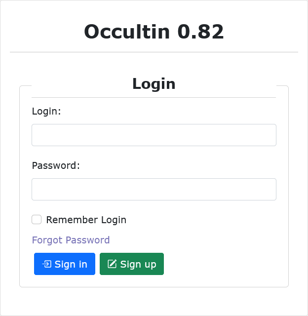

.. _Sec:Getting Started:

Getting Started
===============

Install OccultIN
----------------

The OccultIN Software is available to download via https://getoccultin.org.

Save and extract the compressed file in the desired location and extract its contents. Once
extracted execute ``AsyncQueueTasks.exe``.

Suported Operating Systems
^^^^^^^^^^^^^^^^^^^^^^^^^^
The interface was developed and tested for Windows 10 and 11 operating systems. It has also been
successfully tested in Ubuntu Linux operating systems through Wine [version].

Known Possible Issues
^^^^^^^^^^^^^^^^^^^^^
There are some unwanted behaviors expected in some system configuration scenarios. It is by no means
a bug in the software. Additional configurations may be needed for perfect functioning.

*PATH Environment Variable*
Please make sure that in your environmental variables (Windows or Wine/Linux) an implicit "."
directory path is added. The absence of it will cause failure in generating the occultation maps
images, and ultimately, also failing to complete the task of predicting occultations.

Creating a User Account
-----------------------

When you start the application for the first time, it is necessary to sign up for a user account.
The OccultIN interface is developed to support multiple users and, therefore, an account is needed
to start using the interface. The account consists of a user, an email, and a password.

You can sign in or sign up when you open the application. If you do not have an account yet, you can
go to the "Sign Up" page, where you will be asked to add your information. Since you are using a  If
you are using the desktop version, all information iswill be stored locally and will be erased if you
delete the application from your machine. Although now the usage is local, an email is required for
compatibility proposes for future web applications.

A username and email can be only associated with a single account. Duplicates are not allowed. Only
one account is permitted for each email and you can’t use the same username twice, since it is an
identifier. For now, there are noaren’t restrictions on your password, as it is, currently, a local
application.

After submitting it, you have created an account! Add your email or username (both options work) and
password to enter it. If the option “Remember Login” is selected, you will not be asked for this
information again when you reopen the application and will automatically log into your account. If
needed, there is an option to reset your password.
