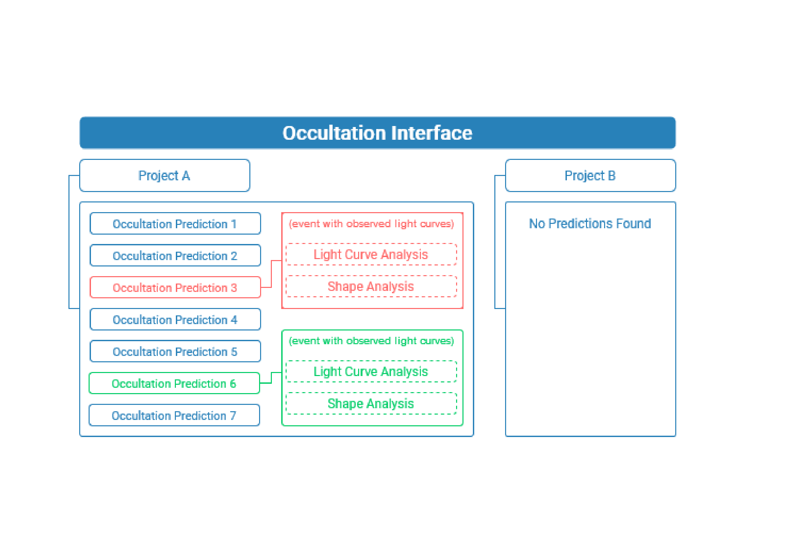

.. _Sec:projects:

Projects
========

The organization of the data inside the occultation interface is done by means of projects. They are the highest level of data organization and can be accessed only one at a time. Every project has a name and a description and can host one or multiple objects of interest for which occultation predictions will be searched. 

When an occultation prediction is found it means that it is likely for the shadow of the event to be projected onto Earth within the given uncertainties. Errors may occur due to imprecise ephemeris and star position. Further analysis for this event, such as the determination of the real instants of the occultation at a given location and/or fitting the projected shape of the object will need additional observation data. When provided, each occultation prediction entry/result will act as a starting point to add and analyze additional data.

Projects can be created and removed on the home screen of the application. The creation of a project is linked with the generation of an occultation prediction by design. Once a project is created, it will not be possible to change its attributes. Any updates to a project will require the creation of a new project.

Occultation Predictions
------------------------

In this section we will describe how to use the Occultation Prediction Interface. This UI section is divided into 5 sequential screens: Project Name, Solar System Object, Time Range, Extra Information, and Summary.
^
Project Name
^^^^^^^^^^^^^^^^^^

The first step when initializing a new project consists of naming and describing it. Naming the project is required, whilst adding a description is optional. The name field is the project's identifier, therefore it must be unique. Add a description to further describe the project if needed.

Solar System Object
^^^^^^^^^^^^^^^^^^^^

One or multiple objects can be added as targets for occultation predictions in each project.  The field “Object Name” needs to receive a valid identifier for their database - the official name of the body, the spkid, or the designated number for the query are all options to be provided. Once you provide a valid object's identifier you can choose the source to retrieve the target's ephemeris: online or local. If you choose the online method a query is submitted to the JPL Small-Body Database.

For the body ephemeris, it is suggested to use the 'Horizons/JPL' query, as it is the default in the application. It may be necessary to use BSP files if the object is not included in the database. Again, be aware of the format used and that this is more challenging if you have no experience with BSP files or the application.

Although it is possible to add and work with multiple bodies, creating a project for each object of interest for this interface version is recommended, as the configurations for the search you'll add further on will count for all bodies included. Those, of course, can demand distinct configurations given, for example, the density of stars in the body field.

Time Range
^^^^^^^^^^^^^^^^^^^^

The next step is adding a time interval to the prediction, with start and end times. The time inserted, if written manually, should have the format “yyyy-mm-dd” for the date and “hour: minute” for the hour. Note that the format considers times from 00:00 to 23:59, not AM and PM. There is also a display calendar to pick dates from.

Beyond that, this page also requires mandatory Prediction Parameters. The “Star Magnitude Limit” asks for the maximum star magnitude to lookup for prediction (default is 10). The “Search Step” is the step in seconds to calculate the predictions (default is 60) and the “Segment (divs)” is the number of divisions on the stellar catalog to perform the search (default is 1). Increasing this number is advised if large amounts of data are expected to be retrieved.

Extra Information
^^^^^^^^^^^^^^^^^^^^

Extra information is dealt with in two fields, “Catalog” (default is “gaiardr3”) and “Off-Earth Sigma” (default is 1). 

The catalog where the interface will search for the stars can be changed to “gaiadr2”, but for the general application, it is sufficient to keep the default.

The “Off-Earth Sigma'' means that occultations that have an off-Earth ephemeris error sigma equal to the input number are considered. Increasing this number will make occultations with larger off-Earth sigma errors to be found and counted as results.

Summary
^^^^^^^^^^^^^^^^^^^^

This step summarizes all the information provided to be checked before creating the project. It is impossible to edit the data afterward without creating a new project. No extra action is required on this page.
